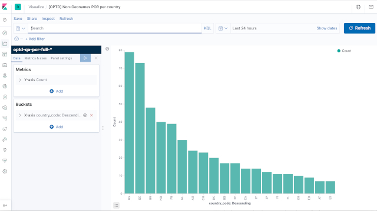
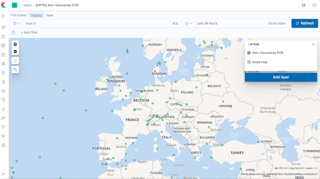

Quality Assurance (QA) for OpenTravelData (OPTD)
================================================

[](https://travis-ci.com/opentraveldata/quality-assurance)
[](https://hub.docker.com/repository/docker/infrahelpers/optd-qa/general)
[](https://quay.io/repository/opentraveldata/quality-assurance)

# Table of Content (ToC)
- [Quality Assurance (QA) for OpenTravelData (OPTD)](#quality-assurance--qa--for-opentraveldata--optd-)
- [Table of Content (ToC)](#table-of-content--toc-)
- [Overview](#overview)
  * [See also](#see-also)
  * [ElasticSearch (ES)](#elasticsearch--es-)
    + [Ingest processors](#ingest-processors)
- [Quick starter](#quick-starter)
  * [Through a pre-built Docker image](#through-a-pre-built-docker-image)
- [Installation](#installation)
  * [With a manually built Docker image](#with-a-manually-built-docker-image)
  * [Through a local cloned Git repository (without Docker)](#through-a-local-cloned-git-repository--without-docker-)
  * [On the local environment (without Docker)](#on-the-local-environment--without-docker-)
    + [Pyenv and `pipenv`](#pyenv-and--pipenv-)
  * [Launch the Python checkers](#launch-the-python-checkers)
  * [Elasticsearch](#elasticsearch)
    + [Re-set the read-write property of indices](#re-set-the-read-write-property-of-indices)
    + [Simplified pipeline and index](#simplified-pipeline-and-index)
    + [POR full index and pipeline](#por-full-index-and-pipeline)
    + [Todo](#todo)
- [Checks](#checks)
  * [Points of Reference (POR)](#points-of-reference--por-)
    + [OPTD consistency and Geonames ID](#optd-consistency-and-geonames-id)
    + [POR having no geo-location in OPTD](#por-having-no-geo-location-in-optd)
    + [City POR not in OPTD](#city-por-not-in-optd)
    + [Multi-city POR in OPTD](#multi-city-por-in-optd)
    + [OPTD vs IATA](#optd-vs-iata)
    + [State codes](#state-codes)
    + [OPTD vs UN/LOCODE](#optd-vs-un-locode)
  * [Airlines](#airlines)
    + [Airport Bases / Hubs](#airport-bases---hubs)
    + [Airline networks](#airline-networks)
    + [Airline appearing in schedules but not in OPTD](#airline-appearing-in-schedules-but-not-in-optd)
- [Publishing to ElasticSearch (ES)](#publishing-to-elasticsearch--es-)
  * [Example - OPTD consistency and Geonames](#example---optd-consistency-and-geonames)
- [Querying ElasticSearch (ES) and Kibana](#querying-elasticsearch--es--and-kibana)
  * [Histograms](#histograms)
  * [Maps](#maps)

<small><i><a href='https://ecotrust-canada.github.io/markdown-toc/'>Table of contents generated with markdown-toc</a></i></small>

# Overview
[That repository](https://github.com/opentraveldata/quality-assurance)
features scripts to check the quality of the data files
produced by the Open Travel Data (OPTD) project.

Though it is not there yet, that project should produce
a Quality Assurance (QA) dashboard, much like
[Geonames' one](https://qa.geonames.org/qa/). See the
[Geonames use case on the Data Quality reference page](https://github.com/data-engineering-helpers/data-quality/blob/main/README.md#geonames)
for more details.

And, hopefully, that dashboard will be powered by
[container images](https://github.com/opentraveldata/quality-assurance/blob/master/docker/)
generated thanks to that repository as well.

[Travis CI](https://travis-ci.com) builds are partially covering the tests
in https://travis-ci.com/opentraveldata/quality-assurance

Most of the scripts generate CSV data files, which can then be uploaded
in databases (classical relational database systems (RDBMS) such as PostgreSQL
or ElasticSearch (ES)), or served through standard Web applications.
For historical reasons, some scripts may still generate JSON structures
on the standard output. In the future, JSON should be used only for metadata,
not for the data itself.

The CSV reports are published (thanks to Travis CI) to an OPTD-operated
ElasticSearch (ES) cluster. The full details on how to setup that ES cluster,
on Proxmox LXC containers, are given in a [dedicated `elasticsearch`
tutorial](https://github.com/infra-helpers/induction-monitoring/tree/master/elasticseearch/).

For convenience, most of the ES examples are demonstrated both on a local
single-node installation (_e.g._, on a laptop) and on on the above-mentioned
cluster.

## See also
* [Service Delivery Quality (SDQ) GitHub organization](https://github.com/service-delivery-quality)
  + [Quality Assurance samples](https://github.com/service-delivery-quality/quality-assurance)
* [Geonames' QA dashboard](https://qa.geonames.org/qa/)
* [Quality Assurance (QA) images on Docker Cloud](https://cloud.docker.com/u/infrahelpers/repository/docker/infrahelpers/optd-qa)
* [Induction on monitoring with Elasticsearch](https://github.com/infra-helpers/induction-monitoring)
* [How to set up a Python virtual environment](https://github.com/machine-learning-helpers/induction-python/tree/master/installation/virtual-env)

## ElasticSearch (ES)
* [ElasticSearch](https://elasitc.co) stacks:
  + [EFK (ElasticSearch, Fluentd, Kibana](https://docs.fluentd.org/v/0.12/articles/docker-logging-efk-compose)
  + [Kibana](https://www.elastic.co/products/kibana)
  + [Fluentd](https://www.fluentd.org/)
* [Tutorial - Setup an ES cluster on Proxmox LXC containers](https://github.com/infra-helpers/induction-monitoring/tree/master/elasticseearch/))
* [Elasticsearch geo-point](https://www.elastic.co/guide/en/elasticsearch/reference/current/geo-point.html)

### Ingest processors
* Main: https://www.elastic.co/guide/en/elasticsearch/reference/current/ingest-processors.html
* [Grok processor](https://www.elastic.co/guide/en/elasticsearch/reference/current/grok-processor.html)
* [CSV processor](https://www.elastic.co/guide/en/elasticsearch/reference/current/csv-processor.html)
* [Date processor](https://www.elastic.co/guide/en/elasticsearch/reference/current/date-processor.html)
* [Script processor](https://www.elastic.co/guide/en/elasticsearch/reference/current/script-processor.html)

# Quick starter

## Through a pre-built Docker image
* Retrieve the Docker image:
```bash
$ docker pull infrahelpers/optd-qa:latest
```

* Launch the Docker-powered scripts:
```bash
$ docker run --rm -it infrahelpers/optd-qa:latest bash
[build@8ce25cc20a10 opentraveldata-qa (master)] make checkers
[build@8ce25cc20a10 opentraveldata-qa (master)] exit
```

# Installation

## With a manually built Docker image
* See
  [the Dockerfile for more details](https://github.com/opentraveldata/quality-assurance/blob/master/docker/run-checkers/Dockerfile)

## Through a local cloned Git repository (without Docker)
* Clone the
  [OpenTravelData (OPTD) Quality Assurance (QA) Git repository](https://github.com/opentraveldata/quality-assurance):
```bash
$ mkdir -p ~/dev/geo
$ git clone https://github.com/opentraveldata/quality-assurance.git ~/dev/geo/opentraveldata-qa
$ pushd ~/dev/geo/opentraveldata-qa
$ ./mkLocalDir.sh
$ popd
```

## On the local environment (without Docker)
As detailed in the
[online guide on how to set up a Python virtual environment](https://github.com/machine-learning-helpers/induction-python/tree/master/installation/virtual-env),
[Pyenv](https://github.com/pyenv/pyenv) and
[`pipenv`](https://pypi.org/project/pipenv) should be installed,
and Python 3.9 installed thanks to Pyenv.
Then all the Python scripts will be run thanks to `pipenv`.

### Pyenv and `pipenv`
* As a summary of what has been detailed in above-mentioned how-to (and which
  needs only to be done once and for all):
```bash
$ if [ ! -d ${HOME}/.pyenv ]; then pushd ${HOME} && git clone https://github.com/pyenv/pyenv.git $HOME/.pyenv && popd; else pushd ${HOME}/.pyenv && git pull && popd; fi
$ export PYENV_ROOT="${HOME}/.pyenv"; export PATH="${PYENV_ROOT}/.pyenv/shims:${PATH}"; if command -v pyenv 1>/dev/null 2>&1; then eval "$(pyenv init -)"; fi
$ pyenv install 3.9.1 && pyenv global 3.9.1 && pip install -U pip pipenv && pyenv global system
$ pushd ~/dev/geo/opentraveldata-qa
$ pipenv install
$ popd
```

* To update the Python dependencies:
```bash
$ pushd ~/dev/geo/opentraveldata-qa
$ pipenv update
$ git add Pipfile.lock
$ pipenv lock -r > requirements.txt
$ git add requirements.txt
$ git commit -m "[Python] Upgraded the Python dependencies"
$ git push
$ popd
```

* See then the
  [`ci-scripts/` directory of OPTD](https://github.com/opentraveldata/opentraveldata/blob/master/ci-scripts/README.md),
  as the [`requirements.txt` file there](https://github.com/opentraveldata/opentraveldata/blob/master/ci-scripts/requirements.txt)
  needs to upgraded accordingly ([cloned from this repository](https://github.com/opentraveldata/quality-assurance/blob/master/requirements.txt))

## Launch the Python checkers
* Use the `Makefile` to launch all the checkers (previous content may first
  be removed, for instance if they have been generated another day):
```bash
$ rm -f to_be_checked/* && rm -f results/*
$ make
```

* Use `pipenv` to launch specific Python scripts. For instance:
```bash
$ pipenv run python checkers/check-por-cmp-optd-unlc.py
$ pipenv run python checkers/check-por-geo-id-in-optd.py
```

* Or use a convenient shortcut provided by the `Makefile` approach:
```bash
$ make results/optd-qa-por-optd-not-in-unlc.csv
pipenv run python checkers/check-por-cmp-optd-unlc.py && \
	wc -l results/optd-qa-por-unlc-not-in-optd.csv results/optd-qa-por-optd-not-in-unlc.csv && head -3 results/optd-qa-por-unlc-not-in-optd.csv results/optd-qa-por-optd-not-in-unlc.csv
   10324 results/optd-qa-por-unlc-not-in-optd.csv
     124 results/optd-qa-por-optd-not-in-unlc.csv
   10448 total
==> results/optd-qa-por-unlc-not-in-optd.csv <==
por_code^unlc_iata_code^unlc_ctry_code^unlc_state_code^unlc_short_code^unlc_name_utf8^unlc_name_ascii^unlc_coord_lat^unlc_coord_lon^unlc_change_code^unlc_status^unlc_is_port^unlc_is_rail^unlc_is_road^unlc_is_apt^unlc_is_postoff^unlc_is_icd^unlc_is_fxtpt^unlc_is_brdxing^unlc_is_unkwn
ADFMO^^AD^^FMO^La Farga de Moles^La Farga de Moles^^^^RQ^0^0^1^0^0^0^0^1^0
AEABU^^AE^^ABU^Abu al Bukhoosh^Abu al Bukhoosh^25.29^53.08^^RL^1^0^0^0^0^0^0^0^0

==> results/optd-qa-por-optd-not-in-unlc.csv <==
unlc_code^geo_id^fclass^fcode^geo_lat^geo_lon^iso31662_code^iso31662_name
AROBE^3430340^P^PPLA2^-27.48706^-55.11994^N^Misiones
AUREN^2155718^P^PPLX^-38.03333^145.3^VIC^Victoria

$ make results/optd-qa-por-best-not-in-geo.csv 
pipenv run python checkers/check-por-geo-id-in-optd.py && \
	wc -l results/optd-qa-por-best-not-in-geo.csv results/optd-qa-por-best-incst-code.csv results/optd-qa-por-dup-geo-id.csv results/optd-qa-por-cmp-geo-id.csv && head -3 results/optd-qa-por-best-not-in-geo.csv results/optd-qa-por-best-incst-code.csv results/optd-qa-por-dup-geo-id.csv results/optd-qa-por-cmp-geo-id.csv
     616 results/optd-qa-por-best-not-in-geo.csv
       1 results/optd-qa-por-best-incst-code.csv
       1 results/optd-qa-por-dup-geo-id.csv
       1 results/optd-qa-por-cmp-geo-id.csv
     619 total
...
```

## Elasticsearch

### Re-set the read-write property of indices
* Local installation:
```bash
$ curl -XPUT -H "Content-Type: application/json" http://localhost:9200/_all/_settings -d '{"index.blocks.read_only_allow_delete": null}'|jq
  % Total    % Received % Xferd  Average Speed   Time    Time     Time  Current
                                 Dload  Upload   Total   Spent    Left  Speed
100    66  100    21  100    45     82    175 --:--:-- --:--:-- --:--:--   257
```
```javascript
{
  "acknowledged": true
}
```

* Remote installation:
```bash
$ ssh root@tiproxy8 -f -L9400:10.30.2.191:9200 sleep 5; curl -XPUT -H "Content-Type: application/json" http://localhost:9400/_all/_settings -d '{"index.blocks.read_only_allow_delete": null}'|jq
  % Total    % Received % Xferd  Average Speed   Time    Time     Time  Current
                                 Dload  Upload   Total   Spent    Left  Speed
100    66  100    21  100    45     82    175 --:--:-- --:--:-- --:--:--   257
```
```javascript
{
  "acknowledged": true
}
```

### Simplified pipeline and index
* [Simulate a simplified targetted pipeline](elastic/optd-qa-pipeline-simulation-por-optd-geo-diff.json):
```bash
$ curl -XPOST "http://localhost:9200/_ingest/pipeline/_simulate" -H "Content-Type: application/json" --data "@elastic/optd-qa-pipeline-simulation-por-optd-geo-diff.json"|jq
  % Total    % Received % Xferd  Average Speed   Time    Time     Time  Current
                                 Dload  Upload   Total   Spent    Left  Speed
100  1435  100   496  100   939  62000   114k --:--:-- --:--:-- --:--:--  175k
```
```javascript
{
  "docs": [
    {
      "doc": {
        "_index": "subway_info",
        "_type": "_doc",
        "_id": "AVvJZVQEBr2flFKzrrkr",
        "_source": {
          "iata_code": "DOH",
          "optd_coord": {
            "lon": "51.565056",
            "lat": "25.261125"
          },
          "distance": "4.368154282573759",
          "weighted_distance": "20197.72392862065",
          "location_type": "C",
          "geoname_id": "290030",
          "country_code": "QA",
          "page_rank": "0.4622857726179021",
          "geo_coord": {
            "lon": "51.53096",
            "lat": "25.28545"
          },
          "adm1_code": "01",
          "timestamp": "2020-03-20T15:12:23.000+01:00"
        },
        "_ingest": {
          "timestamp": "2020-03-20T23:26:02.29742Z"
        }
      }
    }
  ]
}
```
```bash
$ ssh root@tiproxy8 -f -L9400:10.30.2.191:9200 sleep 5; curl -XPOST "http://localhost:9400/_ingest/pipeline/_simulate" -H "Content-Type: application/json" --data "@elastic/optd-qa-pipeline-simulation-por-optd-geo-diff.json"|jq
  % Total    % Received % Xferd  Average Speed   Time    Time     Time  Current
                                 Dload  Upload   Total   Spent    Left  Speed
100  1435  100   496  100   939  62000   114k --:--:-- --:--:-- --:--:--  175k
```
```javascript
{
  ...
}
```

### POR full index and pipeline
* [Simulate the full POR index pipeline](elastic/optd-qa-pipeline-simulation-por-optd-full.json):
```bash
$ curl -XPOST "http://localhost:9200/_ingest/pipeline/_simulate" -H "Content-Type: application/json" --data "@elastic/optd-qa-pipeline-simulation-por-optd-full.json"|jq

  % Total    % Received % Xferd  Average Speed   Time    Time     Time  Current
                                 Dload  Upload   Total   Spent    Left  Speed
100 15053  100  8583  100  6470   128k  99538 --:--:-- --:--:-- --:--:--  226k
```
```javascript
{
  "docs": [
    {
      "doc": {
        "_index": "optd-qa-por-full",
        "_type": "optd_qa_por_full",
        "_id": "AAA1",
        "_source": {
          "continent_name": "Oceania",
          "reporting_reason": "AAA-C-6947726 not found in optd",
          "geoname_id": "6947726",
          "adm2_name_ascii": "",
          "moddate": "2012-04-29",
          "adm1_code": "",
          "asciiname": "Anaa Airport",
          "city_name_list": "Anaa",
          "fcode": "AIRP",
          "adm2_code": "",
          "wiki_link": "https://en.wikipedia.org/wiki/Anaa_Airport",
          "unlc_list": "",
          "population": "0",
          "icao_code": "NTGA",
          "date_until": "",
          "country_code": "PF",
          "alt_name_section": "ru|Анаа|=wkdt|Q1430785|",
          "name": "Anaa Airport",
          "uic_list": "",
          "date_from": "",
          "iata_code": "AAA",
          "distance": "",
          "timezone": "Pacific/Tahiti",
          "is_geonames": "Y",
          "dst_offset": "-10.0",
          "coord": {
            "lon": "-145.509956",
            "lat": "-17.352606"
          },
          "adm4_code": "",
          "ccy_code": "XPF",
          "cc2": "",
          "country_name": "French Polynesia",
          "wac": "823",
          "gtopo30": "8",
          "adm1_name_ascii": "",
          "timestamp": "2020-03-29T15:12:23.000+02:00",
          "elevation": "",
          "fclass": "S",
          "faa_code": "",
          "envelope_id": "",
          "weighted_distance": "",
          "tvl_por_list": "",
          "adm2_name_utf": "",
          "location_type": "A",
          "geo_coord": {
            "lon": "-145.51229",
            "lat": "-17.34908"
          },
          "page_rank": "0.013618936015262465",
          "adm1_name_utf": "",
          "city_detail_list": "AAA|4034700|Anaa|Anaa",
          "city_code_list": "AAA",
          "wac_name": "French Polynesia",
          "adm3_code": "",
          "iso31662": "",
          "comment": "",
          "gmt_offset": "-10.0",
          "raw_offset": "-10.0"
        },
        "_ingest": {
          "timestamp": "2020-03-29T21:34:41.308529Z"
        }
      }
    },
    {
      "doc": {
        "_index": "optd-qa-por-full",
        "_type": "optd_qa_por_full",
        "_id": "BVD",
        "_source": {
          "continent_name": "North America",
          "reporting_reason": "",
          "geoname_id": "0",
          "adm2_name_ascii": "",
          "moddate": "-1",
          "adm1_code": "",
          "asciiname": "Beaver Inlet AK US Sea Port",
          "city_name_list": "Beaver Inlet AK US Sea Port",
          "fcode": "AIRP",
          "adm2_code": "",
          "wiki_link": "",
          "unlc_list": "",
          "population": "",
          "icao_code": "",
          "date_until": "",
          "country_code": "US",
          "alt_name_section": "",
          "name": "Beaver Inlet AK US Sea Port",
          "uic_list": "",
          "date_from": "",
          "iata_code": "BVD",
          "distance": "",
          "timezone": "America/Anchorage",
          "is_geonames": "N",
          "dst_offset": "",
          "coord": {
            "lon": "-147.4",
            "lat": "66.36"
          },
          "adm4_code": "",
          "ccy_code": "USD",
          "cc2": "",
          "country_name": "United States",
          "wac": "1",
          "gtopo30": "",
          "adm1_name_ascii": "",
          "timestamp": "2020-03-29T15:12:23.000+02:00",
          "elevation": "",
          "fclass": "S",
          "faa_code": "",
          "envelope_id": "",
          "weighted_distance": "",
          "tvl_por_list": "BVD",
          "adm2_name_utf": "",
          "location_type": "CA",
          "geo_coord": {
            "lon": "",
            "lat": ""
          },
          "page_rank": "",
          "adm1_name_utf": "",
          "city_detail_list": "BVD|0|Beaver Inlet AK US Sea Port|Beaver Inlet AK US Sea Port",
          "city_code_list": "BVD",
          "wac_name": "Alaska",
          "adm3_code": "",
          "iso31662": "AK",
          "comment": "",
          "gmt_offset": "",
          "raw_offset": ""
        },
        "_ingest": {
          "timestamp": "2020-03-29T21:45:00.548234Z"
        }
      }
    },
	...
    {
      "doc": {
        "_index": "optd-qa-por-full",
        "_type": "optd_qa_por_full",
        "_id": "BSL",
        "_source": {
          "continent_name": "Europe",
          "reporting_reason": "",
          "geoname_id": "6299466",
          "adm2_name_ascii": "Haut-Rhin",
          "moddate": "2020-03-15",
          "adm1_code": "44",
          "asciiname": "EuroAirport Basel-Mulhouse-Freiburg",
          "city_name_list": "Basel",
          "fcode": "AIRP",
          "adm2_code": "68",
          "wiki_link": "https://en.wikipedia.org/wiki/EuroAirport_Basel_Mulhouse_Freiburg",
          "unlc_list": "CHBSL|=FRMLH|",
          "population": "0",
          "icao_code": "LFSB",
          "date_until": "",
          "country_code": "FR",
          "alt_name_section": "es|Aeropuerto de Basilea-Mulhouse-Friburgo|=de|Flughafen Basel-Mülhausen|=it|Aeroporto di Basilea-Mulhouse-Friburgo|=ca|Aeroport de Basilea-Mulhouse-Friburg|=en|EuroAirport Basel–Mulhouse–Freiburg|p=fr|Aéroport de Bâle-Mulhouse-Fribourg|=wuu|巴塞尔-米卢斯-弗赖堡欧洲机场|=ru|Международный аэропорт Базель-Мюлуз-Фрайбург|=ja|ユーロエアポート|=fa|فرودگاه بازل-مولوز-فرایبورگ اروپا|",
          "name": "EuroAirport Basel–Mulhouse–Freiburg",
          "uic_list": "",
          "date_from": "",
          "iata_code": "BSL",
          "distance": "",
          "timezone": "Europe/Paris",
          "is_geonames": "Y",
          "dst_offset": "2.0",
          "coord": {
            "lon": "7.52991",
            "lat": "47.58958"
          },
          "adm4_code": "68135",
          "ccy_code": "EUR",
          "cc2": "",
          "country_name": "France",
          "wac": "427",
          "gtopo30": "263",
          "adm1_name_ascii": "Grand Est",
          "timestamp": "2020-03-29T15:12:23.000+02:00",
          "elevation": "269",
          "fclass": "S",
          "faa_code": "",
          "envelope_id": "",
          "weighted_distance": "",
          "tvl_por_list": "",
          "adm2_name_utf": "Haut-Rhin",
          "location_type": "A",
          "geo_coord": {
            "lon": "",
            "lat": ""
          },
          "page_rank": "0.09830056026668005",
          "adm1_name_utf": "Grand Est",
          "city_detail_list": "BSL|2661604|Basel|Basel",
          "city_code_list": "BSL",
          "wac_name": "France",
          "adm3_code": "684",
          "iso31662": "GES",
          "comment": "",
          "gmt_offset": "1.0",
          "raw_offset": "1.0"
        },
        "_ingest": {
          "timestamp": "2020-03-29T21:34:41.308588Z"
        }
      }
    },
    {
      "doc": {
        "_index": "optd-qa-por-full",
        "_type": "optd_qa_por_full",
        "_id": "MLH",
        "_source": {
          "continent_name": "Europe",
          "reporting_reason": "",
          "geoname_id": "6299466",
          "adm2_name_ascii": "Haut-Rhin",
          "moddate": "2020-03-15",
          "adm1_code": "44",
          "asciiname": "EuroAirport Basel-Mulhouse-Freiburg",
          "city_name_list": "Mulhouse",
          "fcode": "AIRP",
          "adm2_code": "68",
          "wiki_link": "https://en.wikipedia.org/wiki/EuroAirport_Basel_Mulhouse_Freiburg",
          "unlc_list": "CHBSL|=FRMLH|",
          "population": "0",
          "icao_code": "LFSB",
          "date_until": "",
          "country_code": "FR",
          "alt_name_section": "es|Aeropuerto de Basilea-Mulhouse-Friburgo|=de|Flughafen Basel-Mülhausen|=it|Aeroporto di Basilea-Mulhouse-Friburgo|=ca|Aeroport de Basilea-Mulhouse-Friburg|=en|EuroAirport Basel–Mulhouse–Freiburg|p=fr|Aéroport de Bâle-Mulhouse-Fribourg|=wuu|巴塞尔-米卢斯-弗赖堡欧洲机场|=ru|Международный аэропорт Базель-Мюлуз-Фрайбург|=ja|ユーロエアポート|=fa|فرودگاه بازل-مولوز-فرایبورگ اروپا|",
          "name": "EuroAirport Basel–Mulhouse–Freiburg",
          "uic_list": "",
          "date_from": "",
          "iata_code": "MLH",
          "distance": "",
          "timezone": "Europe/Paris",
          "is_geonames": "Y",
          "dst_offset": "2.0",
          "coord": {
            "lon": "7.52991",
            "lat": "47.58958"
          },
          "adm4_code": "68135",
          "ccy_code": "EUR",
          "cc2": "",
          "country_name": "France",
          "wac": "427",
          "gtopo30": "263",
          "adm1_name_ascii": "Grand Est",
          "timestamp": "2020-03-29T15:12:23.000+02:00",
          "elevation": "269",
          "fclass": "S",
          "faa_code": "",
          "envelope_id": "",
          "weighted_distance": "",
          "tvl_por_list": "",
          "adm2_name_utf": "Haut-Rhin",
          "location_type": "A",
          "geo_coord": {
            "lon": "",
            "lat": ""
          },
          "page_rank": "0.013945526285525285",
          "adm1_name_utf": "Grand Est",
          "city_detail_list": "MLH|2991214|Mulhouse|Mulhouse",
          "city_code_list": "MLH",
          "wac_name": "France",
          "adm3_code": "684",
          "iso31662": "GES",
          "comment": "",
          "gmt_offset": "1.0",
          "raw_offset": "1.0"
        },
        "_ingest": {
          "timestamp": "2020-03-29T21:34:41.308611Z"
        }
      }
    }
  ]
}
```
```bash
$ ssh root@tiproxy8 -f -L9400:10.30.2.191:9200 sleep 5; curl -XPOST "http://localhost:9400/_ingest/pipeline/_simulate" -H "Content-Type: application/json" --data "@elastic/optd-qa-pipeline-simulation-por-optd-full.json"|jq

  % Total    % Received % Xferd  Average Speed   Time    Time     Time  Current
                                 Dload  Upload   Total   Spent    Left  Speed
100 15053  100  8583  100  6470   128k  99538 --:--:-- --:--:-- --:--:--  226k
```
```javascript
{
```

* Create the [full POR index](elastic/optd-qa-index-por-optd-full.json):
```bash
$ curl -XPUT "http://localhost:9200/optd-qa-por-full-v1" -H "Content-Type: application/json" --data "@elastic/optd-qa-index-por-optd-full.json" | jq
  % Total    % Received % Xferd  Average Speed   Time    Time     Time  Current
                                 Dload  Upload   Total   Spent    Left  Speed
100  2361  100    78  100  2283     16    485  0:00:04  0:00:04 --:--:--    22
```
```javascript
{
  "acknowledged": true,
  "shards_acknowledged": true,
  "index": "optd-qa-por-full-v1"
}
```
```bash
$ ssh root@tiproxy8 -f -L9400:10.30.2.191:9200 sleep 5; curl -XPUT "http://localhost:9400/optd-qa-por-full-v1" -H "Content-Type: application/json" --data "@elastic/optd-qa-index-por-optd-full.json" | jq

  % Total    % Received % Xferd  Average Speed   Time    Time     Time  Current
                                 Dload  Upload   Total   Spent    Left  Speed
100 15053  100  8583  100  6470   128k  99538 --:--:-- --:--:-- --:--:--  226k
```
```javascript
{
  "acknowledged": true,
  "shards_acknowledged": true,
  "index": "optd-qa-por-full-v1"
}
```

* Check the settings of the newly created index:
```bash
$ curl -XGET "http://localhost:9200/optd-qa-por-full-v1/_settings"|jq
  % Total    % Received % Xferd  Average Speed   Time    Time     Time  Current
                                 Dload  Upload   Total   Spent    Left  Speed
100   230  100   230    0     0   1932      0 --:--:-- --:--:-- --:--:--  1932
```
```javascript
{
  "optd-qa-por-full-v1": {
    "settings": {
      "index": {
        "creation_date": "1585518863340",
        "number_of_shards": "1",
        "number_of_replicas": "1",
        "uuid": "5TUCUvj6RMesAcx_UFexQQ",
        "version": {
          "created": "7060199"
        },
        "provided_name": "optd-qa-por-full-v1"
      }
    }
  }
}
```
```bash
$ ssh root@tiproxy8 -f -L9400:10.30.2.191:9200 sleep 5; curl -XGET "http://localhost:9400/optd-qa-por-full-v1/_settings"|jq

  % Total    % Received % Xferd  Average Speed   Time    Time     Time  Current
                                 Dload  Upload   Total   Spent    Left  Speed
100 15053  100  8583  100  6470   128k  99538 --:--:-- --:--:-- --:--:--  226k
```
```javascript
{
  "optd-qa-por-full-v1": {
    "settings": {
      "index": {
        "creation_date": "1586650616710",
        "number_of_shards": "1",
        "number_of_replicas": "1",
        "uuid": "PaseFEBWSRuKhWNjxKNqtg",
        "version": {
          "created": "7060299"
        },
        "provided_name": "optd-qa-por-full-v1"
      }
    }
  }
}
```

* By default, the number of replicas is 1, _i.e._, the index is replicated once.
  That is not possible on single-node clusters. Hence, the health of the index
  will appear in yellow. To fix that issue, from within the browser,
  with the Kibana application, edit the settings of the `optd-qa-por-full-v1`
  index
  (http://localhost:5601/app/kibana#/management/elasticsearch/index_management/indices)
  and set the `number_of_replicas` parameter to 0 (instead of 1).
  Save the setiings. The health parameter should now be green.
  Or, with the command-line:
```bash
$ curl -XPUT "http://localhost:9200/optd-qa-por-full-v1/_settings" -H "Content-Type: application/json" -d "{ \"index\": { \"blocks\": { \"read_only_allow_delete\": \"false\" } } }" | jq
  % Total    % Received % Xferd  Average Speed   Time    Time     Time  Current
                                 Dload  Upload   Total   Spent    Left  Speed
100    85  100    21  100    64     12     37  0:00:01  0:00:01 --:--:--    49
```
```javascript
{
  "acknowledged": true
}
```
```bash
$ curl -XPUT "http://localhost:9200/optd-qa-por-full-v1/_settings" -H "Content-Type: application/json" -d "{ \"index\" : { \"number_of_replicas\" : 0 } }" | jq
  % Total    % Received % Xferd  Average Speed   Time    Time     Time  Current
                                 Dload  Upload   Total   Spent    Left  Speed
100    63  100    21  100    42     25     50 --:--:-- --:--:-- --:--:--    75
```
```javascript
{
  "acknowledged": true
}
```

* If, for any reason, the index must be re-created, it can be deleted as follows:
```bash
$ curl -XDELETE "http://localhost:9200/optd-qa-por-full-v1" | jq
  % Total    % Received % Xferd  Average Speed   Time    Time     Time  Current
                                 Dload  Upload   Total   Spent    Left  Speed
100    21  100    21    0     0     26      0 --:--:-- --:--:-- --:--:--    26
```
```javascript
{
  "acknowledged": true
}
```
```bash
$ ssh root@tiproxy8 -f -L9400:10.30.2.191:9200 sleep 5; curl -XDELETE "http://localhost:9400/optd-qa-por-full-v1" | jq
  % Total    % Received % Xferd  Average Speed   Time    Time     Time  Current
                                 Dload  Upload   Total   Spent    Left  Speed
100 15053  100  8583  100  6470   128k  99538 --:--:-- --:--:-- --:--:--  226k
```
```javascript
{
  "acknowledged": true
}
```

* Create the
  [pipeline for the full POR index](elastic/optd-qa-pipeline-por-optd-full.json):
```bash
$ curl -XPUT "http://localhost:9200/_ingest/pipeline/parse_optd_por_full_csv" -H "Content-Type: application/json" --data "@elastic/optd-qa-pipeline-por-optd-full.json"|jq
  % Total    % Received % Xferd  Average Speed   Time    Time     Time  Current
                                 Dload  Upload   Total   Spent    Left  Speed
100  1906  100    21  100  1885     26   2413 --:--:-- --:--:-- --:--:--  2437
```
```javascript
{
  "acknowledged": true
}
```
```bash
$ ssh root@tiproxy8 -f -L9400:10.30.2.191:9200 sleep 5; curl -XPUT "http://localhost:9400/_ingest/pipeline/parse_optd_por_full_csv" -H "Content-Type: application/json" --data "@elastic/optd-qa-pipeline-por-optd-full.json"|jq
  % Total    % Received % Xferd  Average Speed   Time    Time     Time  Current
                                 Dload  Upload   Total   Spent    Left  Speed
100 15053  100  8583  100  6470   128k  99538 --:--:-- --:--:-- --:--:--  226k
```
```javascript
{
  "acknowledged": true
}
```

* Check the pipeline:
```bash
$ curl -XGET "http://localhost:9200/_ingest/pipeline/parse_optd_por_full_csv"|jq
  % Total    % Received % Xferd  Average Speed   Time    Time     Time  Current
                                 Dload  Upload   Total   Spent    Left  Speed
100  1793  100  1793    0     0  71720      0 --:--:-- --:--:-- --:--:-- 71720
```
```javascript
{
  "parse_optd_por_full_csv": {
    "description": "Parsing the OPTD (OpenTravelData) POR (Points of Reference) QA (Quality Assurance) reports",
    "processors": [
      {
        "grok": {
          "field": "optd_qa_por_full",
          "patterns": [
            "^%{DATA:reporting_reason}\\^%{OPT_WORD:iata_code}\\^%{OPT_WORD:icao_code}\\^%{OPT_WORD:faa_code}\\^%{WORD:is_geonames}\\^%{INT:geoname_id}\\^%{OPT_INT:envelope_id}\\^%{DATA:name}\\^%{DATA:asciiname}\\^%{OPT_NUMBER:coord.lat}\\^%{OPT_NUMBER:coord.lon}\\^%{OPT_WORD:fclass}\\^%{OPT_WORD:fcode}\\^%{OPT_NUMBER:page_rank}\\^%{OPT_DATE:date_from}\\^%{OPT_DATE:date_until}\\^%{DATA:comment}\\^%{OPT_WORD:country_code}\\^%{OPT_WORD:cc2}\\^%{DATA:country_name}\\^%{DATA:continent_name}\\^%{OPT_WORD:adm1_code}\\^%{DATA:adm1_name_utf}\\^%{DATA:adm1_name_ascii}\\^%{OPT_WORD:adm2_code}\\^%{DATA:adm2_name_utf}\\^%{DATA:adm2_name_ascii}\\^%{OPT_WORD:adm3_code}\\^%{OPT_WORD:adm4_code}\\^%{OPT_INT:population}\\^%{OPT_INT:elevation}\\^%{OPT_INT:gtopo30}\\^%{DATA:timezone}\\^%{OPT_NUMBER:gmt_offset}\\^%{OPT_NUMBER:dst_offset}\\^%{OPT_NUMBER:raw_offset}\\^%{OPT_DATE:moddate}\\^%{DATA:city_code_list}\\^%{DATA:city_name_list}\\^%{DATA:city_detail_list}\\^%{DATA:tvl_por_list}\\^%{OPT_WORD:iso31662}\\^%{OPT_WORD:location_type}\\^%{DATA:wiki_link}\\^%{DATA:alt_name_section}\\^%{OPT_WORD:wac}\\^%{DATA:wac_name}\\^%{OPT_WORD:ccy_code}\\^%{DATA:unlc_list}\\^%{DATA:uic_list}\\^%{OPT_NUMBER:geo_coord.lat}\\^%{OPT_NUMBER:geo_coord.lon}\\^%{OPT_NUMBER:distance}\\^%{OPT_NUMBER:weighted_distance}$"
          ],
          "pattern_definitions": {
            "OPT_DATE": "(%{YEAR}-%{MONTHNUM2}-%{MONTHDAY}|-1)?",
            "OPT_INT": "(%{INT})?",
            "OPT_NUMBER": "(%{NUMBER})?",
            "OPT_WORD": "(%{WORD})?"
          }
        }
      },
      {
        "remove": {
          "field": "optd_qa_por_full"
        }
      },
      {
        "date": {
          "field": "timestamp",
          "target_field": "timestamp",
          "formats": [
            "yyyy-MM-dd HH:mm:ss"
          ],
          "timezone": "Etc/UTC"
        }
      }
    ]
  }
}
```
```bash
$ ssh root@tiproxy8 -f -L9400:10.30.2.191:9200 sleep 5; curl -XGET "http://localhost:9400/_ingest/pipeline/parse_optd_por_full_csv"|jq
  % Total    % Received % Xferd  Average Speed   Time    Time     Time  Current
                                 Dload  Upload   Total   Spent    Left  Speed
100 15053  100  8583  100  6470   128k  99538 --:--:-- --:--:-- --:--:--  226k
```
```javascript
{
  ...
}
```

* If the pipeline needs to be changed, it can be deleted and then re-created:
```bash
$ curl -XDELETE "http://localhost:9200/_ingest/pipeline/parse_optd_por_full_csv"|jq
```
```javascript
{
  "acknowledged": true
}
```
```bash
$ ssh root@tiproxy8 -f -L9400:10.30.2.191:9200 sleep 5; curl -XDELETE "http://localhost:9400/_ingest/pipeline/parse_optd_por_full_csv"|jq
  % Total    % Received % Xferd  Average Speed   Time    Time     Time  Current
                                 Dload  Upload   Total   Spent    Left  Speed
100 15053  100  8583  100  6470   128k  99538 --:--:-- --:--:-- --:--:--  226k
```
```javascript
{
  "acknowledged": true
}
```

### Todo
* [Issue #1](https://github.com/opentraveldata/quality-assurance/issues/1)

As of April 2020, the resulting CSV data files have various formats. Dumping
the corresponding content into Elasticsearch (ES) would force to have almost
an index per CSV file type, which would slightly defeat the interest of
using ES. Rather, it seems better to merge all the CSV file types into a
single format, allowing to get a single ES index. Then, every CSF file
will be tagged with their respective checking intent. The search and
time-series analysis will be much easier.
So, the next step is to merge all the formats of the CSF files.

# Checks

## Points of Reference (POR)

### OPTD consistency and Geonames ID
* [That script](https://github.com/opentraveldata/quality-assurance/blob/master/checkers/check-por-geo-id-in-optd.py)
  compares the
  [OPTD public POR file](https://github.com/opentraveldata/opentraveldata/blob/master/opentraveldata/optd_por_public.csv)
  with the
  [curated file of best known POR](https://github.com/opentraveldata/opentraveldata/blob/master/opentraveldata/optd_por_best_known_so_far.csv).
  It generates two CSV files:
  + `results/optd-qa-por-best-not-in-optd.csv`, exhibiting the POR manually
    curated in the 
	[file of best known POR](https://github.com/opentraveldata/opentraveldata/blob/master/opentraveldata/optd_por_best_known_so_far.csv)
	but not present in the
    [generated OPTD public file](https://github.com/opentraveldata/opentraveldata/blob/master/opentraveldata/optd_por_public.csv)
  + `results/optd-qa-por-cmp-geo-id.csv`, reporting POR having a
    [Geonames](https://github.com/opentraveldata/opentraveldata/blob/master/data/geonames)
	ID inconsistent among the
	[curated file of best known POR](https://github.com/opentraveldata/opentraveldata/blob/master/opentraveldata/optd_por_best_known_so_far.csv)
	and the
    [generated OPTD public file](https://github.com/opentraveldata/opentraveldata/blob/master/opentraveldata/optd_por_public.csv)

* Note that a CSV file has a single row, it is the header. So, it can be
  considered as empty.
```bash
$ pushd ~/dev/geo/opentraveldata-qa
$ pipenv run checkers/check-por-geo-id-in-optd.py
$ wc -l results/optd-qa-por-best-not-in-optd.csv results/optd-qa-por-cmp-geo-id.csv
11 results/optd-qa-por-best-not-in-optd.csv
 1 results/optd-qa-por-cmp-geo-id.csv
$ ls -lFh results/optd-qa-por-best-not-in-optd.csv results/optd-qa-por-cmp-geo-id.csv
-rw-r--r--  1 user staff 400B Jan 10 15:54 results/optd-qa-por-best-not-in-optd.csv
-rw-r--r--  1 user staff  60B Jan 10 15:54 results/optd-qa-por-cmp-geo-id.csv
$ popd
```

### POR having no geo-location in OPTD
* [That script](https://github.com/opentraveldata/quality-assurance/blob/master/checkers/check-por-optd-no-geocoord.py)
  spots POR missing geo-location in the
  [OPTD public POR file](https://github.com/opentraveldata/opentraveldata/blob/master/opentraveldata/optd_por_public.csv).
  It generates a CSV file:
  + `results/optd-qa-por-optd-no-geocoord.csv`, reporting the POR having no
  geo-location (geo-coordinates)

* Note that if a CSV file has a single row, it is the header. So, it can be
  considered as empty.
```bash
$ pushd ~/dev/geo/opentraveldata-qa
$ make results/optd-qa-por-optd-no-geocoord.csv
pipenv run python checkers/check-por-optd-no-geocoord.py && \
	wc -l results/optd-qa-por-optd-no-geocoord.csv && head -3 results/optd-qa-por-optd-no-geocoord.csv
       1 results/optd-qa-por-optd-no-geocoord.csv
iata_code^geo_id^loc_type
$ popd
```

### City POR not in OPTD
* [That script](https://github.com/opentraveldata/quality-assurance/blob/master/checkers/check-por-city-not-in-optd.py)
  compares the
  [OPTD public POR file](https://github.com/opentraveldata/opentraveldata/blob/master/opentraveldata/optd_por_public.csv)
  with the
  [curated file of best known POR](https://github.com/opentraveldata/opentraveldata/blob/master/opentraveldata/optd_por_best_known_so_far.csv).
  It generates a CSV file:
  + `results/optd-qa-por-city-not-in-optd.csv`, reporting the POR in the curated 
  [file of best known POR](https://github.com/opentraveldata/opentraveldata/blob/master/opentraveldata/optd_por_best_known_so_far.csv)
  with cities not referenced as a city in the
  [generated OPTD public file](https://github.com/opentraveldata/opentraveldata/blob/master/opentraveldata/optd_por_public.csv)

* Note that if a CSV file has a single row, it is the header. So, it can be
  considered as empty.
```bash
$ pushd ~/dev/geo/opentraveldata-qa
$ make results/optd-qa-por-city-not-in-optd.csv
pipenv run python checkers/check-por-city-not-in-optd.py && \
	wc -l results/optd-qa-por-city-not-in-optd.csv && head -3 results/optd-qa-por-city-not-in-optd.csv
       1 results/optd-qa-por-city-not-in-optd.csv
iata_code^optd_pk^loc_type^geo_id^city_code
$ popd
```

### Multi-city POR in OPTD
* [That script](https://github.com/opentraveldata/quality-assurance/blob/master/checkers/check-por-multiple-cities.py)
  compares the
  [OPTD public POR file](https://github.com/opentraveldata/opentraveldata/blob/master/opentraveldata/optd_por_public.csv)
  with the
  [curated file of best known POR](https://github.com/opentraveldata/opentraveldata/blob/master/opentraveldata/optd_por_best_known_so_far.csv).
  It generates two CSV files:
  + `results/optd-qa-por-multi-city.csv`, reporting POR with multiple cities
  + `results/optd-qa-por-multi-city-not-std.csv`, reporting POR
    with multiple cities not following the sorting order of PageRank values

* Note that if a CSV file has a single row, it is the header. So, it can be
  considered as empty.
```bash
$ pushd ~/dev/geo/opentraveldata-qa
$ make results/optd-qa-por-multi-city.csv
pipenv run python checkers/check-por-multiple-cities.py && \
	wc -l results/optd-qa-por-multi-city.csv results/optd-qa-por-multi-city-not-std.csv && head -3 results/optd-qa-por-multi-city.csv results/optd-qa-por-multi-city-not-std.csv
     111 results/optd-qa-por-multi-city.csv
      30 results/optd-qa-por-multi-city-not-std.csv
     141 total
==> results/optd-qa-por-multi-city.csv <==
iata_code^optd_pk^loc_type^geo_id^city_code_list^page_rank
ADJ^ADJ-A-250437^A^250437^AMM,ADJ^0.09819215728644931,0.0
AGY^AGY-R-10377026^R^10377026^MUC,AGY^0.35785165780444,0.0

==> results/optd-qa-por-multi-city-not-std.csv <==
iata_code^optd_pk^loc_type^geo_id^city_code_list^page_rank
BQC^BQC-B-11279243^B^11279243^BQC,YQB^0.006501240960634933,0.05835677851287664
BVV^BVV-A-8030061^A^8030061^BVV,ITU^0.0,0.006116247321847354
$ popd
```

### OPTD vs IATA
* [That script](https://github.com/opentraveldata/quality-assurance/blob/master/checkers/check-por-cmp-optd-it.py)
  compares the
  [OPTD-referenced POR having a UN/LOCODE code](https://github.com/opentraveldata/opentraveldata/blob/master/opentraveldata/optd_por_unlc.csv)
  with the
  [ones referenced by IATA](https://github.com/opentraveldata/opentraveldata/blob/master/data/IATA).
  It has to be noted that the Python script first downloads the
  [`iata_airport_list_latest.csv` file](https://github.com/opentraveldata/opentraveldata/blob/master/data/IATA/iata_airport_list_latest.csv),
  which is actually a symbolic link. Then, the Python script downloads
  the actual data file, say for instance
  [`archives/iata_airport_list_20190418.csv`](https://github.com/opentraveldata/opentraveldata/blob/master/data/IATA/archives/iata_airport_list_20190418.csv).
  The script then generates a few CSV files:
  + `results/optd-qa-por-optd-no-it.csv`, exhibiting the POR
    referenced by OPTD but not by IATA
  + `results/optd-qa-por-it-not-optd.csv`, exhibiting the POR
    referenced by IATA but not by OPTD
  + `results/optd-qa-por-it-no-valid-in-optd.csv`, exhibiting the POR
    referenced by IATA but no longer valid in OPTD
  + `results/optd-qa-por-it-in-optd-as-city-only.csv`, exhibiting the POR
    referenced by OPTD only as cities (whereas they appear in IATA
	also as transport-/travel-related)
  + `results/optd-qa-state-optd-it-diff.csv`, exhibiting the POR
    having different state codes in IATA and OPTD

* Note that if a CSV file has a single row, it is the header. So, it can be
  considered as empty.
```bash
$ pushd ~/dev/geo/opentraveldata-qa
$ make results/optd-qa-por-optd-no-it.csv
pipenv run python checkers/check-por-cmp-optd-it.py && \
	wc -l results/optd-qa-state-optd-it-diff.csv results/optd-qa-por-optd-no-it.csv results/optd-qa-por-it-not-optd.csv results/optd-qa-por-it-no-valid-in-optd.csv results/optd-qa-por-it-in-optd-as-city-only.csv && head -3 results/optd-qa-state-optd-it-diff.csv results/optd-qa-por-optd-no-it.csv results/optd-qa-por-it-not-optd.csv results/optd-qa-por-it-no-valid-in-optd.csv results/optd-qa-por-it-in-optd-as-city-only.csv
!!!!! Remaining entry of the file of state-related known exceptions: {'full_state_code': 'RU-PRI', 'wrong_state_code': '25'}. Please, remove that from the 'https://github.com/opentraveldata/opentraveldata/blob/master/opentraveldata/optd_state_exceptions.csv?raw=true' file.
      24 results/optd-qa-state-optd-it-diff.csv
      68 results/optd-qa-por-optd-no-it.csv
       1 results/optd-qa-por-it-not-optd.csv
       1 results/optd-qa-por-it-no-valid-in-optd.csv
       1 results/optd-qa-por-it-in-optd-as-city-only.csv
      95 total
==> results/optd-qa-state-optd-it-diff.csv <==
por_code^in_optd^in_iata^env_id^date_from^date_until^it_state_code^it_ctry_code^it_cty_code^it_loc_type^optd_geo_id^optd_state_code^optd_city_state_list^optd_ctry_code^optd_cty_list^optd_loc_type^optd_feat_class^optd_feat_code^optd_page_rank
CQW^1^1^^2019-12-10^^320^CN^CQW^A^12110887^CQ^CQ^CN^CQW^A^S^AIRP^
DBD^1^1^^^^JH^IN^DBD^A^7730214^BR^BR^IN^DBD^CA^S^AIRP^

==> results/optd-qa-por-optd-no-it.csv <==
iata_code^geoname_id^iso31662^country_code^city_code_list^location_type^fclass^fcode^page_rank
DDP^4564133^^PR^DDP^CA^P^PPLA^
DGB^8693083^AK^US^DGB^A^S^AIRP^

==> results/optd-qa-por-it-not-optd.csv <==
iata_code^iata_name^iata_loc_type^iata_ctry_code^iata_state_code^it_tz_code^it_cty_code^it_cty_name

==> results/optd-qa-por-it-no-valid-in-optd.csv <==
iata_code^envelope_id^date_from^date_until^it_state_code^it_country_code^it_city_code^it_location_type^geoname_id^iso31662^country_code^city_code_list^location_type^fclass^fcode^page_rank

==> results/optd-qa-por-it-in-optd-as-city-only.csv <==
por_code^in_optd^in_iata^env_id^date_from^date_until^it_state_code^it_ctry_code^it_cty_code^it_loc_type^optd_geo_id^optd_state_code^optd_ctry_code^optd_cty_list^optd_loc_type^optd_feat_class^optd_feat_code^optd_page_rank
$ popd
```

### State codes

* The checker is the same as above (`checkers/check-por-cmp-optd-it.py`)

* Check the number of POR having different state codes,
  broken down by country:
```bash
$ awk -F'^' '{print $8}' results/optd-qa-state-optd-it-diff.csv|sort|uniq -c|sort -nr|head -5
 342 CN
 288 FR
 185 DE
 175 GB
 138 RU$ 
```

* Check the number of POR having differrent state codes for a specific country:
```bash
$ awk -F'^' '{if ($8 == "CN") {print $8 "^" $7 "^" $12}}' results/optd-qa-state-optd-it-diff.csv|sort|uniq -c|sort -nr|head -5
  33 CN^^GD
  24 CN^^NM
  24 CN^^HB
  19 CN^^ZJ
  19 CN^^LN
```

* Add some exception rules in the
  [`optd_state_exceptions.csv` CSV file](https://github.com/opentraveldata/opentraveldata/blob/master/opentraveldata/optd_state_exceptions.csv):
```bash
$ head -3 to_be_checked/optd_state_exceptions.csv
pk^state_code^geo_id^source^env_id^date_from^date_to^wrong_state_code^comment
AR-C^C^3433955^IR^^^^BA^State code in source does not reflect any of the known standards (be it ISO 3166-2 or IATA codes), but seems to correspond to the phonetic initials. References: https://en.wikipedia.org/wiki/ISO_3166-2:AR, https://en.wikipedia.org/wiki/Provinces_of_Argentina
AR-H^H^3861887^IR^^^^CH^State code in source does not reflect any of the known standards (be it ISO 3166-2 or IATA codes), but seems to correspond to the first two letters of the state name. References: https://en.wikipedia.org/wiki/ISO_3166-2:AR, https://en.wikipedia.org/wiki/Provinces_of_Argentina
```

### OPTD vs UN/LOCODE
* [That script](https://github.com/opentraveldata/quality-assurance/blob/master/checkers/check-por-cmp-optd-unlc.py)
  compares the
  [OPTD-referenced POR having a UN/LOCODE code](https://github.com/opentraveldata/opentraveldata/blob/master/opentraveldata/optd_por_unlc.csv)
  with the
  [ones referenced by UN/LOCODE](https://github.com/opentraveldata/opentraveldata/blob/master/data/unlocode).
  It generates two CSV files:
  + `results/optd-qa-por-optd-not-in-unlc.csv`, exhibiting the POR
    referenced by OPTD but not by UN/LOCODE
  + `iresults/optd-qa-por-unlc-not-in-optd.csv`, exhibiting the POR
    referenced by UN/LOCODE but not by OPTD

* Note that if a CSV file has a single row, it is the header. So, it can be
  considered as empty.
```bash
$ pushd ~/dev/geo/opentraveldata-qa
$ pipenv run checkers/check-por-cmp-optd-unlc.py
$ wc -l results/optd-qa-por-unlc-not-in-optd.csv
10349 results/optd-qa-por-unlc-not-in-optd.csv
$ ls -lFh results/optd-qa-por-*unlc*.csv
-rw-r--r-- 1 user staff 4.7M Dec 13 18:22 results/optd-qa-por-optd-not-in-unlc.csv
-rw-r--r-- 1 user staff 763K Dec 13 18:22 results/optd-qa-por-unlc-not-in-optd.csv
$ popd
```

* In order to get the IATA-referenced POR out of UN/LOCODE-referenced ones:
```bash
$ pushd ~/dev/geo/opentraveldata-qa
$ awk -F'^' '{if ($2 != "") {print $0}}' results/optd-qa-por-unlc-not-in-optd.csv | wc -l
21
$ popd
```

## Airlines

### Airport Bases / Hubs
* [That script](https://github.com/opentraveldata/quality-assurance/blob/master/checkers/check-airline-bases.py)
  checks, for every airline of the
  [`optd_airlines.csv` file](https://github.com/opentraveldata/opentraveldata/blob/master/opentraveldata/optd_airlines.csv),
  that the airport bases/hubs are appearing in the
  [`optd_airline_por_rcld.csv` file](https://github.com/opentraveldata/opentraveldata/blob/master/opentraveldata/optd_airline_por_rcld.csv).

* Note that both files
  ([`optd_airlines.csv`](https://github.com/opentraveldata/opentraveldata/blob/master/opentraveldata/optd_airlines.csv)
  and [`optd_airline_por_rcld.csv`](https://github.com/opentraveldata/opentraveldata/blob/master/opentraveldata/optd_airline_por_rcld.csv))
  will be downloaded from the
  [OpenTravelData project](https://github.com/opentraveldata/opentraveldata)
  and stored within the `to_be_checked` directory. If those files are too old,
  they should be removed (a newer version will then be automatically downloaded
  and stored again).

* Note that a CSV file has a single row, it is the header. So, it can be
  considered as empty.

* The following script displays all the missing airport bases/hubs:
```bash
$ pushd ~/dev/geo/opentraveldata-qa
$ ./mkLocalDir.sh
$ pipenv run python checkers/check-airline-bases.py
$ wc -l results/optd-qa-airline-bases-not-in-flight-legs.csv
22 results/optd-qa-airline-bases-not-in-flight-legs.csv
$ head -3 results/optd-qa-airline-bases-not-in-flight-legs.csv
airline_3char_code^airline_2char_code^airline_name^base_iata_code
ABG^RL^Royal Flight^VKO
RUN^9T^MyCargo Airlines^IST
$ popd
```

If the script does not return anything, then the check (successfully) passes.

### Airline networks
* [That script](https://github.com/opentraveldata/quality-assurance/blob/master/checkers/check-airline-networks.py)
  performs, for every airline of the
  [`optd_airlines.csv` file](https://github.com/opentraveldata/opentraveldata/blob/master/opentraveldata/optd_airlines.csv),
  some basic statistics on their network, modelled as graph (where
  POR are nodes and flight segments/legs are edges):
```bash
$ pushd ~/dev/geo/opentraveldata-qa
$ pipenv run checkers/check-airline-networks.py
$ wc -l results/optd-qa-airline-network-far-nodes.csv
7 results/optd-qa-airline-network-far-nodes.csv
$ ls -lFh results/optd-qa-airline-*.csv
-rw-r--r--  1 user  staff   8.8K Dec 13 18:47 results/optd-qa-airline-network-far-nodes.csv
-rw-r--r--  1 user  staff    34B Dec 13 18:47 results/optd-qa-airline-network-zero-distance.csv
-rw-r--r--  1 user  staff    87B Dec 13 18:47 results/optd-qa-airline-network-zero-edges.csv
-rw-r--r--  1 user  staff    70B Dec 13 18:47 results/optd-qa-airline-por-not-in-optd.csv
-rw-r--r--  1 user  staff   136B Dec 13 18:47 results/optd-qa-airline-zero-coord-por-in-optd.csv
$ cut -d'^' -f1,1 results/optd-qa-airline-network-far-nodes.csv | grep -v "^airline"
9W
B5
KD
NS
P2
X3
$ cat results/optd-qa-airline-network-zero-edges.csv | grep -v "^airline"
BY^MAN^MAN^1.0
MT^BHX^BHX^1.0
ZB^LBA^LBA^1.0
$ popd
```

### Airline appearing in schedules but not in OPTD
* [That script](https://github.com/opentraveldata/quality-assurance/blob/master/checkers/check-airline-sched-in-optd.py)
  checks, for every airline appearing in the
  [`optd_airline_por_rcld.csv` file](https://github.com/opentraveldata/opentraveldata/blob/master/optd_airline_por_rcld.csv),
  whether they are also referenced by OpenTravelData (OPTD) in the
  [`optd_airlines.csv` file](https://github.com/opentraveldata/opentraveldata/blob/master/opentraveldata/optd_airlines.csv):
```bash
$ pushd ~/dev/geo/opentraveldata-qa
$ pipenv run check-airline-sched-in-optd.py
$ wc -l results/optd-qa-airline-schd-not-in-optd.csv
28 results/optd-qa-airline-schd-not-in-optd.csv
$ head -3 results/optd-qa-airline-schd-not-in-optd.csv
airline_code
9Y
AJA
$ popd
```

# Publishing to ElasticSearch (ES)

## Example - OPTD consistency and Geonames

* Ingest the data:
```bash
$ export TIMESTP="$(date -u +'%Y-%m-%d %H:%M:%S')"
$ tail -n +2 results/optd-qa-por-best-not-in-geo.csv | while IFS=; read -r -a arr; do curl -XPOST "http://localhost:9200/optd-qa-por-full-v1/_doc?pipeline=parse_optd_por_full_csv" -H "Content-Type: application/json" -d "{ \"tag\": [\"optd\", \"qa\", \"checker\", \"por\", \"geonames\", \"check-por-geo-id-in-optd.py\", \"optd-qa-por-best-not-in-geo.csv\"], \"timestamp\": \"${TIMESTP}\", \"optd_qa_por_full\": \"${arr[@]}\" }"; done
```
```javascript
  % Total    % Received % Xferd  Average Speed   Time    Time     Time  Current
                                 Dload  Upload   Total   Spent    Left  Speed
100   660  100   186  100   474   1430   3646 --:--:-- --:--:-- --:--:--  5076
  % Total    % Received % Xferd  Average Speed   Time    Time     Time  Current
                                 Dload  Upload   Total   Spent    Left  Speed
100   835  100   186  100   649    712   2486 --:--:-- --:--:-- --:--:--  3199
{
  "_index": "optd-qa-por-full-v1",
  "_type": "_doc",
  "_id": "8cSoKHEBu3P1TMMtzG4v",
  "_version": 1,
  "result": "created",
  "_shards": {
    "total": 1,
    "successful": 1,
    "failed": 0
  },
  "_seq_no": 1,
  "_primary_term": 1
}
{
  "_index": "optd-qa-por-full-v1",
  "_type": "_doc",
  "_id": "8sSoKHEBu3P1TMMtzG6f",
  "_version": 1,
  "result": "created",
  "_shards": {
    "total": 1,
    "successful": 1,
    "failed": 0
  },
  "_seq_no": 2,
  "_primary_term": 1
}
```
```bash
$ export TIMESTP="$(date -u +'%Y-%m-%d %H:%M:%S')"
$ wc -l results/optd-qa-por-best-not-in-geo.csv
     616 results/optd-qa-por-best-not-in-geo.csv
$ ssh root@tiproxy8 -f -L9400:10.30.2.191:9200 sleep 600
$ tail -n +2 results/optd-qa-por-best-not-in-geo.csv | while IFS=; read -r -a arr; do curl -XPOST "http://localhost:9400/optd-qa-por-full-v1/_doc?pipeline=parse_optd_por_full_csv" -H "Content-Type: application/json" -d "{ \"tag\": [\"optd\", \"qa\", \"checker\", \"por\", \"geonames\", \"check-por-geo-id-in-optd.py\", \"optd-qa-por-best-not-in-geo.csv\"], \"timestamp\": \"${TIMESTP}\", \"optd_qa_por_full\": \"${arr[@]}\" }"; done
  % Total    % Received % Xferd  Average Speed   Time    Time     Time  Current
                                 Dload  Upload   Total   Spent    Left  Speed
100 15053  100  8583  100  6470   128k  99538 --:--:-- --:--:-- --:--:--  226k
```
```javascript
{
  ...
}
```

# Querying ElasticSearch (ES) and Kibana

The ElasticSearch (ES) REST API is also the one to use for Kibana queries.

## Histograms
* Query:
  [`optd-qa-kibana-request-por-non-geo-hist-ctry.json` query](elastic/optd-qa-kibana-request-por-non-geo-hist-ctry.json)
* Response:
  [`optd-qa-kibana-response-por-non-geo-hist-ctry.json` query](elastic/optd-qa-kibana-response-por-non-geo-hist-ctry.json)



* Launch on the command-line the
 [`optd-qa-kibana-response-por-non-geo-map.json` query](elastic/optd-qa-kibana-response-por-non-geo-map.json):
```bash
$ curl -XGET "http://localhost:9200/optd-qa-por-full-v1/_search" \
	-H "Content-Type: application/json" \
	--data "@elastic/optd-qa-kibana-request-por-non-geo-hist-ctry.json" | jq \
	> elastic/optd-qa-kibana-response-por-non-geo-hist-ctry.json
$ ssh root@tiproxy8 -f -L9400:10.30.2.191:9200 sleep 5; \
	curl -XGET "http://localhost:9400/optd-qa-por-full-v1/_search" \
	-H "Content-Type: application/json" \
	--data "@elastic/optd-qa-kibana-request-por-non-geo-hist-ctry.json" | jq \
	> elastic/optd-qa-kibana-response-por-non-geo-hist-ctry.json
```

* It generates the [`optd-qa-kibana-response-por-non-geo-hist-ctry.json`
  response](elastic/optd-qa-kibana-response-por-non-geo-hist-ctry.json)

## Maps
* Query:
  [`optd-qa-kibana-request-por-non-geo-map.json` query](elastic/optd-qa-kibana-request-por-non-geo-map.json)
* Response: [`optd-qa-kibana-response-por-non-geo-map.json`
  response](elastic/optd-qa-kibana-response-por-non-geo-map.json)



* Launch on the command-line the
 [`optd-qa-kibana-response-por-non-geo-map.json` query](elastic/optd-qa-kibana-response-por-non-geo-map.json):
```bash
$ curl -XGET "http://localhost:9200/optd-qa-por-full-v1/_search" \
	-H "Content-Type: application/json" \
	--data "@elastic/optd-qa-kibana-request-por-non-geo.json" | jq \
	> elastic/optd-qa-kibana-response-por-non-geo-map.json
$ ssh root@tiproxy8 -f -L9400:10.30.2.191:9200 sleep 5; \
	curl -XGET "http://localhost:9400/optd-qa-por-full-v1/_search" \
	-H "Content-Type: application/json" \
	--data "@elastic/optd-qa-kibana-request-por-non-geo.json" | jq \
	> elastic/optd-qa-kibana-response-por-non-geo-map.json
```

* It generates the [`optd-qa-kibana-response-por-non-geo-map.json`
  response](elastic/optd-qa-kibana-response-por-non-geo-map.json)

